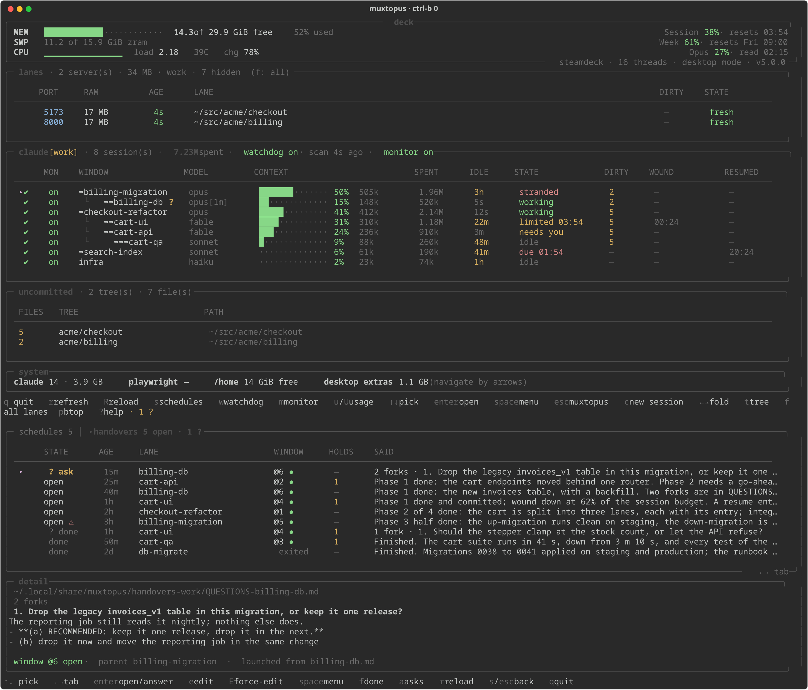

# Muxtopus

**Run several Claude Code sessions side by side in tmux — one per account — and stop losing work to usage limits.**



One command opens a tmux session for an account, brings up that account's watchdog, and lands you on a live dashboard of every lane you have running. Everything on screen is read from local files and tmux panes: nothing here calls an API, and watching costs no tokens.

---

## Why this exists

`autoContinueAtUsageLimit` does not resume after the 5-hour session limit. Measured twice on the same machine, the second time under clean conditions: a session started fresh with the setting armed hit the limit at 09:42, the limit reset at 12:40, and it was still idle at 13:39.

The reason is visible in the transcript. The limit is written as a `<synthetic>` assistant message with `read=0` and the turn marked **done** — the CLI *ends* the turn rather than parking it, so there is nothing left for auto-continue to resume. `/loop` has the same hole from the other side: a refused turn never reaches the call that schedules the next wakeup, so one refusal kills the loop permanently.

So the only thing that reliably restarts the work is something **outside** Claude Code. That is the watchdog.

The second half of the problem is accounts. A personal and a work account on one machine want two of everything — two budgets, two reset times, two sets of sessions — and a single shared state directory will happily hand one account's reset time to the other account's window.

---

## Install

```bash
git clone https://github.com/AlexZ005/Muxtopus.git ~/src/muxtopus
cd ~/src/muxtopus
./install.sh
```

The installer symlinks `mux` into `~/.local/bin`, writes a config file, creates the data folders and offers to install the watchdog. Nothing is written outside your home directory, and it prints every path before it touches anything.

```bash
./install.sh --dry-run        # print what it would do and stop
./install.sh --home ~/.code   # put schedules/backups/handovers somewhere else
./install.sh --also-cc        # additionally install it as `cc`
```

> **`cc` is not the default name on purpose.** On any machine with a C toolchain, a `cc` on `PATH` shadows the C compiler and breaks native builds. Ask for it only if you know your machine has no `cc`.

**One word per account.** `mux` reads the name it was invoked by, so a symlink is an account: `cw` is `mux -w`, and `mux-acme` is `mux -P acme`. The installer links `cw` when `~/.claude-work` exists. This matters most over SSH, where `RemoteCommand` takes a command and has no room for its flags:

```
ssh deck -t 'bash -lc cc'     # personal
ssh deck -t 'bash -lc cw'     # work
```

**Requirements:** `bash`, `tmux` ≥ 3.2 (for `new-window -e`), `jq`, `git`, `python3` ≥ 3.9 with [`rich`](https://github.com/Textualize/rich) for the dashboard, and the `claude` CLI. `systemd --user` is used for the watchdog when present; without it the daemon is started as a plain background process instead.

---

## Quick start

```bash
mux                      # personal account, session "claude"
mux -w                   # work account   (~/.claude-work)
cw                       # the same thing, if the symlink is installed
mux -P acme              # any account    (~/.claude-acme)
mux infra ~/src/infra    # a named session in a directory
mux -w infra ~/src/infra # both
mux -r                   # start Claude with the resume picker
mux -d -P acme           # create it and return, for scripts
mux -l                   # list accounts, sessions and watchdogs
```

A new session gets two windows: **0** is the dashboard, **1** is Claude. You land on 0, so the state of the machine is the first thing you see; `Ctrl-b 1` switches to Claude and `Ctrl-b 0` comes back. Re-attaching returns you to whichever window you left.

**`Ctrl-b w` lists this account's windows only.** Both accounts share one tmux server, and the stock binding lists every session on it — reading the work account's windows off the personal session is exactly the confusion the suffix exists to prevent. The shipped `tmux.conf` filters the chooser to the session you pressed the key in; `Ctrl-b W` is the unfiltered tree, and `f` inside the chooser edits the filter live (empty it to see everything). A filter hides rows; it does not stop you acting on the other account. If the accounts must never be able to touch each other, run them on separate servers with `tmux -L` instead.

`mux -l` is the one-glance answer to "what is running":

```
ACCOUNT      SESSION                  LOGGED-IN  WATCHDOG
personal     claude (6w)              yes        running
work         claude-work (2w)         no         running (disarmed)
```

### Adding an account

Creating the directory is the entire opt-in — nothing has to be registered anywhere:

```bash
mux -P acme        # creates ~/.claude-acme, its folders and its watchdog,
                   # then opens the session. Log in inside window 1.
```

The watchdog for a brand-new account is installed **disarmed** and stays that way until the account logs in. Arming it earlier would have it restart windows into a login screen, and its usage probe would start a doomed session every hour.

---

## One account, one of everything

A profile is the suffix on the Claude config dir. **The default account takes no suffix**, which is the whole migration story: a single-account machine sees no change at all.

| | personal | work |
|---|---|---|
| Claude config | `~/.claude` | `~/.claude-work` |
| tmux session | `claude` | `claude-work` |
| schedules | `$MUXTOPUS_HOME/schedules` | `…/schedules-work` |
| backups | `$MUXTOPUS_HOME/backups` | `…/backups-work` |
| handovers | `$MUXTOPUS_HOME/handovers` | `…/handovers-work` |
| watchdog state + usage cache | `~/.local/state/claude-watchdog` | `…-work` |
| systemd unit | `claude-watchdog.service` | `claude-watchdog-work.service` |

`mux` puts `CLAUDE_CONFIG_DIR` into the tmux **session** with `-e`, not merely into its own process. **A tmux session does not inherit the environment of whatever created it** — it starts from the server's, which belongs to whichever account happened to start the server first. Exporting is therefore not enough, and anything that opens a `claude` under tmux has to hand the account in explicitly: `mux` for its windows, the watchdog for a restarted one, `claude-usage.sh` for its throwaway probe.

**The default account is the variable being absent**, not the variable pointing at `~/.claude`. Claude Code keeps the default account's onboarding and auth state in `~/.claude.json`; set `CLAUDE_CONFIG_DIR` and it looks for `<dir>/.claude.json` instead, which does not exist — so "helpfully" naming the path that account already uses shows a fully logged-in machine the theme picker and the login menu. Named accounts have no such history and always carry the variable.

**One watchdog per account, not one that watches both.** Every figure it judges a session against — session budget, weekly budget, reset time — belongs to a single account. A shared daemon would have to carry two of everything anyway, and could still hand one account's reset to the other account's window.

---

## The dashboard

`Ctrl-b 0`. Everything is read from local files; the process never forks per frame.

| key | |
|---|---|
| `↑` `↓` | pick a session |
| `enter` | open that session's window (`Ctrl-b 0` comes back) |
| `space` | menu for the session under the cursor |
| `s` | scheduled windows |
| `w` | arm / disarm the watchdog |
| `m` | session monitoring (wind-downs) on / off |
| `u` | read usage limits (refreshes if older than 20 min) |
| `U` | force a usage read now |
| `r` / `R` | redraw / reload the script |
| `p` | btop |
| `?` | help |
| `q` | quit |

The **menu** (`space`) carries two per-session switches and then everything you can do to that window: open, rename, wind it down now, resume it now, continue it at low priority, schedule a resume at the next reset, or close it.

### Panels

- **deck** — memory, swap, CPU, and the usage limits top right.
- **lanes** — dev servers by port, with age and whether the tree is dirty.
- **claude** — one row per session: context used, tokens spent, idle time, state, when it was last wound down and when it was last resumed. The account name appears in the title once you have more than one.
- **uncommitted** — its own table rather than a column, because dirty trees and sessions do not line up: a repo can be dirty with no session and no dev server near it, and that is the copy most likely to be lost.

---

## The watchdog

Poll loop, 30 s. It notices a window that stopped at a usage limit, waits for the reset, and types the continue prompt into that pane.

```bash
claude-watchdog.sh --status            # the table it publishes
claude-watchdog.sh --dry-run           # one pass, act on nothing
claude-watchdog.sh --profile work ...  # any account
claude-watchdog.sh --on | --off        # arm / disarm (or `w` on the dashboard)
```

**Session monitoring** is a separate power with its own switch, off by default. The watchdog *restarts* a window that already stopped, which cannot lose anything. Monitoring speaks to a window that is still **working**, asking it to commit and write a handoff before the budget runs out — so it is opt-in on its own.

It is delivered through a `PostToolUse` hook, so it reaches a session mid-turn without typing into a pane that is busy composing. Two bands: past 65% of the session budget the window is asked to stop spawning subagents; past 85% to checkpoint and stop. **The hard band only fires when it buys something** — a context big enough to be worth restarting fresh, or a weekly budget too spent for `/low-priority` to carry the session through. Otherwise the window is left to reach the limit banner, which costs nothing.

The session is never told *why*. It receives an instruction, not a budget negotiation; the reasoning is logged instead.

> **Honest limitation.** Detecting a limit means reading the TUI's own banner out of the pane. That text is not an API, and a redesign upstream can change it. It has been wrong once already in a way worth knowing about: a limit resetting on the hour prints `resets 7pm` with no `:00`, and a pattern that required `H:MM` left every on-the-hour limit parked for hours while off-hour ones resumed correctly. The parser handles both now, and `--dry-run` will tell you what it currently sees.

---

## Scheduled windows

One hand-editable `.md` per window to open later. The daemon launches due items and the dashboard's `s` view lists them.

```
type: work
at: reset
title: resume the checkout refactor
window: api-cleanup
cwd: /home/you/src/checkout
status: pending
created: 2026-09-06 09:55
launched:
---
the prompt body that gets pasted into the new window
```

`at: reset` fires when the session limit resets — or when the budget simply reads fresh, because a brand-new rolling window has no reset time at all. An absolute time (`2026-09-06 14:30`, or anything `date -d` accepts) fires when it passes.

The new window opens right after its `window:` target, named with a leading `➥`, and the prompt lands as **one bracketed paste** — never `send-keys`, which submits at every newline. A file the view cannot parse is shown as corrupted with the reason and never launches.

In the `s` view: `enter`/`e` edit · `c` create · `l` launch now · `d` delete · `r` reload · `s`/`esc` back.

---

## Handovers

When a window is asked to wrap up, it writes a handoff so the *next* window can start from three paragraphs instead of carrying a quarter-million tokens of context forward.

```bash
handover.sh list              # what is open, and how much is done
handover.sh show <name>
handover.sh done <name>       # finished: moves it to done/
handover.sh reopen <name>
handover.sh --profile work list
```

Two decisions worth stating, because both were bugs first:

- **They do not live in the working tree.** A `STATUS-<window>.md` in the repo is scratch state under version control — and once a second account works the same repo, two windows of the same name overwrite each other's handoff without a word.
- **`done` moves, it does not delete.** A finished handoff is the record of what a lane actually did and costs nothing to keep. Moving it is also what makes `list` mean something: what is left in the folder is what is still owed. A repeated window name gets a timestamped second copy rather than erasing the first.

---

## Configuration

`~/.config/muxtopus/config`, plain shell, sourced. It wins over the environment, which wins over the defaults.

```sh
# Where an account's schedules/, backups/ and handovers/ live.
# Default: ${XDG_DATA_HOME:-~/.local/share}/muxtopus
MUXTOPUS_HOME="$HOME/.code"

# The checkout. Only needed if `mux` was copied rather than symlinked,
# so it cannot find its siblings by following its own path.
MUXTOPUS_DIR="$HOME/src/muxtopus"
```

Both halves of the tool — the shell scripts and the Python dashboard — read this one file, so they cannot disagree about where anything lives.

---

## Steam Deck extras

This was built on a Steam Deck in desktop mode, and the setup scripts that make SteamOS a workable dev box are included. They are **not** required by anything above; ignore the whole section on a normal Linux machine.

| script | |
|---|---|
| `setup-deck.sh` | the whole box from scratch: shell env, node, `gh`, the Claude CLI, tmux config, repos, SSH, Playwright, the dashboard venv, the watchdog |
| `after-update.sh` | health check after a SteamOS update, which resets parts of the OS image |
| `apply-sudo.sh` | passwordless sudo |
| `apply-logind.sh` | lingering, so user services survive logout — without it the watchdog dies with your session |
| `apply-hosts.sh` | `/etc/hosts` entries for e2e suites |
| `deck-ram.sh` | where the RAM went |
| `clone-org.sh` | clone every repo in a GitHub org |
| `claude-notify.sh` | phone notifications via ntfy, Pushbullet or Telegram |

SteamOS has an immutable base image: an update can reset system files and your account password. `after-update.sh` checks the things that actually break, including whether each account's credentials survived.

---

## How the pieces fit

```
mux                     open a session for an account, bring up its watchdog
profile.sh              the one resolver: account -> every path it owns
muxconfig.py            the same answers for the Python half
claude-watchdog.sh      the daemon: limits, wind-downs, scheduled windows
claude-usage.sh         reads /usage from a throwaway session, per account
claude-winddown-hook.sh PostToolUse hook: delivers a directive mid-turn
handover.sh             the handoff folder
deck_status.py          the dashboard
deck-status.sh          launcher (venv python, with a bash fallback)
setup-schedules.py      seed an account's schedules + templates
make-screenshot.py      regenerate the screenshot in this README
```

`claude-usage.sh` deserves one note: Claude Code has no usage subcommand and no file holding live limit state, so reading your budget means starting a throwaway session, sending `/usage`, scraping the pane and killing it — about four seconds, no turn taken, no completion tokens. That is why it is on demand and why every reading is stamped with the time it was taken: a stale number must not pass for a current one.

---

## License

MIT — see [LICENSE](LICENSE).
