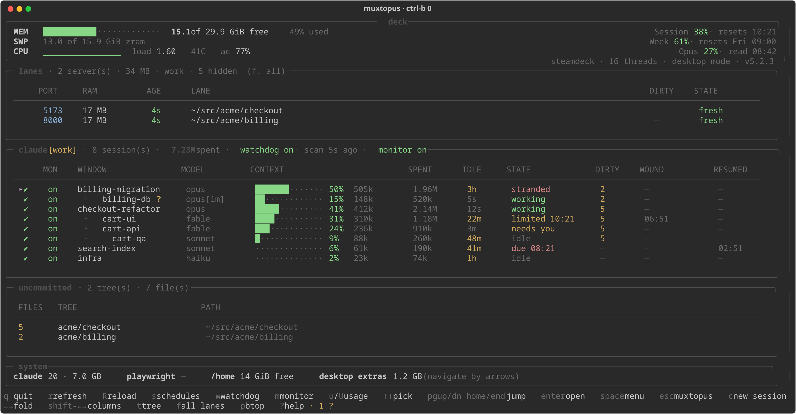


# The dashboard

`Ctrl-b 0`. Everything is read from local files the watchdog publishes; the process never forks per frame, makes no API calls and spends no tokens. It is window 0 of every muxtopus session, and `?` inside it prints the help assembled from the screens that are actually loaded.



## Screens

The dashboard is one main view and three others, each a key away:

| key | screen | page |
|---|---|---|
| — | **main**: deck, lanes, claude (the window tree), uncommitted, system | this page |
| `s` | **scheduled windows**, with the **handovers** tab beside it on `←` `→` | [Scheduled windows](schedules.md), [Handovers](handovers.md) |
| `i` | **insights**: what was used and what it would have cost | [Insights](stats.md) |
| `?` | help, assembled from the loaded modules, with a link to this manual | |

The screens that share a tab strip name each tab **with its count** — `▸schedules 6 │ handovers 4 open · 3 ?` — so from the schedules you can still see how many handovers are open and how many question files are waiting on you.

## Tabs and small terminals

**Nothing is cut off the bottom.** On a short terminal (an 80×24 client) the lanes and claude tables give up rows and scroll, showing `▲ N more` / `▼ N more` the way a long menu does, with the sessions served first; the schedules and handovers tables do the same. If that is still not enough, the uncommitted panel, then the deck header, then the system line step aside, and the claude title says which — a panel you hid yourself, under Settings ▸ Panels, has already left before this rule runs, so the note here never names one of your own choosing.

**A narrow lanes or claude table loses whole columns, never fidelity.** Both go through a horizontal window: a column is drawn at its full width or not at all, nothing is ever squeezed to an ellipsis. The pinned columns — unset, that is the one that names each row, LANE and WINDOW — never scroll off; the rest are a strip that `shift-←` `shift-→` scroll through, and the panel's own bottom border counts what is off each side, reading like `◀ 2 more · 3 more ▶ · shift-←→`. When the pinned columns alone do not fit the width, the border says so instead of offering a key that has nowhere to go. Settings ▸ Columns picks which columns are shown, pinned or hidden; Settings ▸ Panels leaves a whole section out. The schedules table is different — it kept the old rule, and on a narrow one still gives up its least important columns first, `AT`, then `SLUG`, `TYPE` and `FOR`, keeping the title. Either way, no row wraps onto two lines.

**The tab strip shrinks before it scrolls.** Labels go full, then short, then an initial (the tab you are on keeps its name longest); only then do tabs past the first six scroll, with `«2` / `3»` counting what is off each side and the subtitle saying `←→ tab 7/9`. `←` `→` reach every tab, drawn or not.

**Esc ▸ Settings ▸ Tabs** shows or hides each tab. A hidden tab leaves the strip and the `←` `→` cycle, and **hidden wins over locked**: the six that stay on a narrow strip are the first six you have *not* hidden. Nothing becomes unreachable — the tab's marks on the session rows and its note in the footer stay, a key that opens it lands on the first shown tab of its screen (or on it, if all are hidden), and the menu has an **Open … once** row for each hidden tab. The strip's subtitle counts what is hidden.

## Keys on the main view

| key | |
|---|---|
| `↑` `↓` | pick a session, a lane above them, or the extras row below |
| `enter` | open that session's window (`Ctrl-b 0` comes back); on a lane row, show every account's lanes |
| `space` | menu for the session under the cursor |
| `esc` | the muxtopus menu: Settings, Insights, the watchdog and monitor switches, disconnect, reload, quit |
| `c` | a new claude session: a form of every parameter, `Create` on the first row — so `c` `enter` is a window |
| `←` `→` | fold / unfold the subtree under the cursor; `←` on a leaf steps out to its parent |
| `shift-←` `shift-→` | scroll the column window of the table the cursor is in — a lane row scrolls lanes, a session or the extras row scrolls claude |
| `t` | tree ordering on / off |
| `f` | lanes: this account only / every account |
| `s` | scheduled windows — and, on `←`/`→`, the handovers beside them |
| `i` | insights: what was used, and what it would have cost |
| `w` | arm / disarm the watchdog |
| `m` | session monitoring (wind-downs) on / off |
| `u` | read usage limits (refreshes if older than 20 min) |
| `U` | force a usage read now |
| `r` / `R` | redraw / reload the script |
| `p` | btop |
| `?` | help |
| `q` | quit |

**Key routing, one rule.** A prompt, confirm or picker owns the keyboard while it is open, `q` included: typing a window name with a "q" in it must not quit the dashboard. Then an open menu, then the screen you are on, then the shell's own keys (`q R ? p u U w m f`), then the keys that open a screen.

## Panels

- **deck** — memory, swap, CPU, and the usage limits top right.
- **lanes** — dev servers by port, with age and whether the tree is dirty.
- **claude** — one row per session: context used, tokens spent, idle time, state, when it was last wound down and when it was last resumed. The account name appears in the title once you have more than one. A scheduled window that has been idle past `WATCHDOG_STRANDED` (default 120 min) with an open handover and nothing pending that names it reads **`stranded`** rather than `idle` — see [the watchdog](watchdog.md#stranded).
- **uncommitted** — its own table rather than a column, because dirty trees and sessions do not line up: a repo can be dirty with no session and no dev server near it, and that is the copy most likely to be lost. `↑2` beside the file count is two commits not yet pushed.
- **system** — process counts and free disk.

### The claude table

**CONTEXT** is the session's live context against `CLAUDE_CONTEXT_WINDOW` (1,000k by default; set it if yours differs — a running session cannot be asked what its window is). **SPENT** is that session's lifetime input + cache writes + output, the parts billed at or above full rate; cache *reads* are excluded because they cost about a tenth and would swamp the number. Subagent tokens are not included — they never enter the parent transcript. **IDLE** is time since that session last wrote a turn; it goes amber past 15 minutes, so a stalled window reads differently from a finished one. **WOUND** is when a window was last asked to wrap up and **RESUMED** when the watchdog last restarted it. **DIRTY** is a hint for the tree that window is sitting in.

The **STATE** column is the watchdog's word for the window:

| state | |
|---|---|
| `working` | mid-turn |
| `idle` | not mid-turn. A fact about the last turn: the same word for a lane that finished ten minutes ago and one that stopped mid-phase |
| `needs you` | yellow: sitting at a permission or trust prompt. Also sent to the phone, with buttons — see [Notifications](notifications.md) |
| `limited 14:30` | yellow: stopped at a usage limit, waiting for that reset |
| `due 13:00` | red: the reset has passed and it is still sitting there; the watchdog prompts it on its next pass |
| `stranded` | red: a lane, idle past `WATCHDOG_STRANDED`, with an open handover and no pending schedule entry naming it. A label, never a trigger — see [the watchdog](watchdog.md#stranded) |
| `resume due` | yellow: a window a **hard** wind-down told to stop, whose budget window has come back and whose handover is still open. Unlike `stranded` this one *is* going to be touched — see [resuming a wind-down](watchdog.md#resuming-a-wind-down) |
| `(background)` | started with `claude --bg`. It has no terminal, so there is no window for enter to open and no pane for the watchdog to type into — it can be watched but never restarted from here |

A session whose lane has an unanswered QUESTIONS file carries a yellow `?` beside its name, and the key line says how many files are waiting in all. Both read the same folders the handovers tab does, at most once every five seconds, so the main frame pays a glob and no fork.

**Closed windows leave on the next redraw.** The published file is rebuilt once every watchdog pass, so a window closed just after a pass used to sit on this table for most of the next one — measured at 21 and 25 seconds, long enough to arrow onto a row that is not there any more. Each row carries its process id, and the frame has already walked `/proc` for the memory figures, so a row whose process is gone is dropped within one frame. Rows still *appear* at the watchdog's pace, because deciding what a session is costs a transcript read.

### The lanes table

A dev server belongs to the account whose session started it — read off `CLAUDE_CONFIG_DIR` in its environment, which it keeps even after the window that started it is gone, so a daemonised server is still attributed correctly. The table shows this account's by default and the title says how many belong to other accounts; `f`, or enter on a lane row, shows every account's with each one labelled. Arrow up from the first session to reach the lane rows.

| lane state | |
|---|---|
| `fresh` | under 6 h |
| `ageing` | 6–24 h |
| `stale` | over 24 h. A vite server was measured at 2487 MB after three days against 1142 MB fresh, and a long-lived server is also what serves dual module instances |

RAM is summed per **process group**: `npm run dev` and the vite it spawns are separate processes, the port belongs to vite, and npm holds ~70 MB of its own.

### Uncommitted work

**DIRTY** on the lanes table is tracked files changed in that working tree. It is not on the claude table because a session's cwd is often your home, which is not a repo — the question is only answerable per *tree*. A dirty repo with no dev server would then be invisible, so the uncommitted table names those separately. Untracked files are ignored: a scratch file is noise, a modified tracked file is work you could lose.

An unpushed commit is work you could lose too, so a tree that is **ahead** of its upstream is listed even when it is clean, with `↑n` beside its file count (`0 ↑2` is a clean tree two commits ahead) and the unpushed total in the panel's title. The count is against the last `git fetch` — the watchdog never touches the network — and a branch with no upstream, or a detached HEAD, shows no arrow at all rather than a `↑0` it cannot know. Such a tree is listed only when it is dirty. Trees with changed files come first, the most files at the top, then the clean-but-ahead ones. Behind is recorded in `repos.tsv` but not drawn: it is not work this machine could lose.

### Usage limits (top right)

The only numbers here that cannot be computed locally. Claude Code has no usage subcommand and no file holding live limit state, so `u` runs `claude-usage.sh`, which starts a throwaway session, sends `/usage`, reads the pane and kills it — about four seconds, no turn taken. It is on demand for that reason, and the third line carries the time it was read so a stale number cannot pass for a current one.

`u` refreshes only if the figures are over `CLAUDE_USAGE_MAX_AGE` minutes old (20), so leaning on the key costs nothing; `U` forces a read now. `R` reloads the script and nudges the limits the same way `u` does. The watchdog also refreshes hourly on its own, so the numbers stay warm with nobody watching.

**A failed read says so.** It leaves the last good numbers alone and marks the third line `stale`, rather than writing a row of blanks stamped with the current time. A read that cannot get to a prompt names its reason: the account is not logged in, has not trusted the folder, or never finished setup.

The same values are available to scripts and to prompts:

```
claude-usage.sh --brief | --json | --session-pct | --week-pct
claude-usage.sh --ensure 15     refresh only if older than 15 minutes
```

Every reading is appended to `usage.log` with a timestamp. If a limit ever empties *before* the time it promised, that is the one good surprise here, so it is announced loudly and sent to your phone.

## The window tree

**tmux has no window hierarchy.** Its windows are a flat, indexed list per session — there is no parent to set and nothing to collapse. So the tree is *data* the scheduler keeps (`tree.tsv`: slug, parent, window id, pane id, launched-at) and the dashboard is the *view*.

A window the scheduler opened from another one is drawn under it and indented. `←` folds that subtree (the parent then shows `+N`), `→` unfolds it, and `←` on a leaf steps out to the parent. With nothing parented the order is exactly what it always was — sessions by context — so the tree costs nothing until there is one. `t` turns the ordering off entirely.

What the flat list *can* honour, it does: a child is inserted after the last window of its parent's subtree, so a family stays contiguous as siblings arrive. The depth itself lives in the tree, which is what `t` draws. How parentage is decided is on the [schedules page](schedules.md#parent-slug--draw-this-window-under-that-one); `claude-watchdog.sh --tree` prints the tree from the shell.

## The menu (`space`)

Two per-session switches at the top, then everything you can do to the window under the cursor: open, rename, wind it down now, resume it now, continue it at low priority, schedule a resume at the next reset, or close it. Arrows pick, enter chooses, esc closes.

The first switch **excludes one session from the watchdog** (the green checkmark becomes a dot); the second takes it out of monitoring. Both choices live in the watchdog's own files, so they hold whether or not the dashboard is open and survive a restart. Everything is included by default, so a session started tomorrow is covered without being opted in.

**Menus are never clipped.** The room under the panels is measured from the terminal (what Rich will actually draw, not a row count) and the menu scrolls inside it with `▲ N more` / `▼ N more` markers. The `table` layout (default) keeps the panel the cursor is in and draws the menu right under it, dropping what is below while it is open; `modal` centres the menu alone; `bottom` is the old position, capped. With fewer than six lines left, a frame degrades to modal for that one open and the title says so.

## The muxtopus menu (`esc`) and Settings

What is not about one row: **Settings**, **Insights**, the watchdog and monitor switches by their full names (`w` and `m` stay the fast path), **Restore K windows from …** (only while the watchdog holds a [frozen snapshot](restore.md) of windows a dead server took), **Disconnect** (`tmux detach-client`; the dashboard and every window keep running, `muxtopus` attaches again), **Reload** (what `R` does) and **Quit** (the window drops to a shell prompt; typing `muxtopus` there, or anywhere, brings the dashboard back).

Settings are written to `~/.config/muxtopus/dashboard.conf` (`profiles/<name>.dashboard.conf` for a named account), a file the dashboard owns — see [Configuration](configuration.md) — and every one is read back from disk before it is reported as saved: the menu layout, the permission mode, model and effort preselected for a new window, whether such a window is watched and monitored, the working folder offered first, which `settings.json` "make it the default" writes to, the two handovers-tab filters, under **Notifications ▸** what the phone is told, under **Tabs ▸** which tabs the strip shows, under **Columns ▸** which columns of the lanes and claude tables are shown, pinned or hidden, and under **Panels ▸** which of deck, lanes, uncommitted and system are drawn at all — the claude table itself cannot be hidden — and under **Hints ▸** how much of itself the dashboard explains on screen (see [Tabs and small terminals](#tabs-and-small-terminals), which covers columns as well as tabs, and [Configuration](configuration.md) for every key this menu writes).

### Settings ▸ Hints ▸ — what the dashboard explains on screen

The dashboard explains itself in four places, and each has a switch here. **Row descriptions** is the dim sentence under the cursor in a menu, and the line a submenu draws under its own title. **Menu hint line** is the `↑↓ pick · enter choose · esc close` line inside a panel. **Footer key line** is the `q quit  r refresh  R reload …` list under the main view — and under the schedules, handovers and insights views, which each draw one of their own. **Inline table notes** are the parenthesised nudges inside the tables: `(navigate by arrows)`, `(enter reclaims)`, `(f: all)`.

All four start **on**, so a dashboard already in use draws exactly what it drew before until you open this menu. **Expert mode** is one row that moves all four together, in whichever direction is left: with everything on it turns everything off, and from anywhere else — including half-and-half — it turns everything back on. It stores nothing of its own; its label reads the four back (`Expert mode: off`, `: ON`, `: mixed`) and its description says where the next `enter` goes. Every row stays open after a change, so all four can be flipped in one visit.

Turning one off makes its panel **shorter**, not blank: the line is no longer reserved, so a menu with its descriptions and hint line off is two lines smaller than the same menu with them on.

**A message still reaches you whatever is off here**, which is the one thing this menu is not allowed to break. With the menu hint line off, that line comes back for the eight seconds a notice lasts and carries the notice alone — the panel grows by a line when the notice arrives and gives it back when it expires, which is a height change on an *event* and never on a cursor move. With the footer key line off, the notice, the counts other views put on that line and the reset flourish all still draw; only the legend goes. The same rule governs the table notes: `(f: all)` is guidance and can go, but the `· 3 hidden` beside it is a fact about what the table is not showing you and stays.

The four keys are `DASHBOARD_HINTS_ROW_DESC`, `DASHBOARD_HINTS_MENU_LINE`, `DASHBOARD_HINTS_FOOTER_KEYS` and `DASHBOARD_HINTS_TABLE_NOTES` in `dashboard.conf` — see [Configuration](configuration.md).

## A new claude session (`c`)

**One screen, and no modal.** `c` opens a form with every parameter already filled in from the new-window defaults in Settings and `Create` on the first row — so a window you have no particular opinion about is **`c` `enter`**, and one you do is arrowing to that row and pressing enter on it. The form stays open while you change things: set the effort, think again about the folder, set it back. `esc` on a row leaves that row alone; `esc` on the form abandons the whole thing.

```
╭─ new session · ~/work/repo-b ──────────────────────────────────╮
│  ▸ Create [repo-b-quail        ]  and go to its window         │
│                                   · type to rename             │
│    ·········································                   │
│    Sub-window repo-b-quail under lane  empty, no prompt        │
│    Sub-window repo-b-quail under lane  continues from its      │
│                                        handover                │
│    ·········································                   │
│    Folder: ~/work/repo-b  where claude starts                  │
│    Model: fable  (from ~/.claude/settings.json)                │
│    Effort: high                                                │
│    Permission mode: unset  (no flag; the CLI's own default)    │
│    Where: a top-level window                                   │
│    First prompt: (none)  empty makes it a plan entry           │
│    ·········································                   │
│    Cancel                                                      │
╰────────────────────────────────────────────────────────────────╯
```

### The name is typed into the Create row

It is the slug — the window's own name, `STATUS-name.md`, the `handover.sh done name` the worker is told to run — so it is worth reading before you press enter, and what is in the brackets is what enter takes.

Type and it is yours: the first character **replaces** the whole offer rather than being appended to it, backspace clears it, a typed space becomes the hyphen a slug would have had, and the field is padded so the form does not move sideways under you while you type. An empty or already-taken name is refused by `Create` with the reason on the notice line, and the form stays exactly as it was.

It used to be a prompt drawn *over* the form and answered *before* it — a box that resized as you typed, a form that jumped when it closed, and a question you had to dismiss even when the offer was the answer.

What is offered is **the folder and one word**: `scripts-otter`, `repo-b-quail`. The word is there because the second window in a folder used to be `scripts-2` and the third `scripts-3`, and a digit tells you nothing about which of the three you are looking at, while a word can be said out loud and recognised in a list. It is checked against every live window and pending entry before it is offered. **Press `c` again and you get a different word** — asking again is how you say you did not want that one.

### Two sub-window rows

Whenever the cursor is on a live session, two rows sit under `Create`, and each is one `enter`:

| row | |
|---|---|
| **empty, no prompt** | a child of that window with nothing pasted into it — a `plan` entry, so the session opens at a blank prompt with its identity in the system prompt and nothing invented |
| **continues from its handover** | the same child, with the brief `Schedule resume` pastes: read `STATUS-<parent>.md` and carry on from its *How to resume* section. Greyed, with the reason, until that lane has actually written one — `Wind down` in the session menu is what asks for it |

`Create` itself is unchanged and still makes a top-level window.

| row | |
|---|---|
| **Folder** | enter opens the candidates — the cursor's, the setting, every live session's, the dirty trees the watchdog publishes, the checkouts under `MUXTOPUS_HOME` — or a typed path, which must exist |
| **Model** | a CLI *alias* (`opus`, `fable`, `sonnet`…): `--model opus-5`, the MODEL column's spelling, is refused by the CLI and kills the window after it has eaten the paste |
| **Effort** | passed as `claude --effort` |
| **Permission mode** | pinned for the life of the window — it cannot be fixed afterwards |
| **Where** | a top-level window, or under a live one, inserted after that parent's subtree and drawn indented |
| **First prompt** | empty writes a `plan` entry: nothing is pasted, the window opens at a blank prompt, and its identity rides in the system prompt |

**Model, Effort and Permission mode say what you will actually get.** A row nobody has set used to read `(account default)`, which names the mechanism — no flag is passed — and not the outcome. Each now reads the value out of the settings.json layers that will apply (the project's `settings.local.json`, its `settings.json`, then the account's) and names it and the file. When nothing anywhere sets it the row says `unset`, which is a different and honest answer: the CLI's own built-in default applies, and that cannot be known without running claude.

It was seven pickers in a fixed order, which meant answering six questions you had no opinion about to reach the one you did, with no way back to change your mind about the second without abandoning the flow.

Then it **writes a schedule entry** with `at:` already past, and nothing else. It opens no window itself: the watchdog's next pass does the trust dialog, the readiness wait, the bracketed paste, the tree row and the log line, exactly as for any entry — one launcher, whoever asked. The entry carries `model:`, `effort:`, `permission-mode:`, `cwd:`, `parent:`/`window:`, and `watchdog: off` / `monitor: off` when Settings says a new window is not watched or monitored. An empty prompt writes a `plan` entry: nothing is pasted and nothing is typed, so the window opens at a blank prompt; its identity (window, slug, handover file) is in the session's system prompt, where it costs no turn.

**And then it takes you there.** There is no window to jump to at the moment you press `Create` — the launcher has not opened it yet — so the form remembers the slug, the key line reads `opening <name>`, and the tmux client moves to that window the moment it appears. The dashboard keeps running in window 0, so `Ctrl-b 0` comes straight back. After three minutes it stops waiting, and the window is simply there like any other.

Between the template and the editor comes [the options table](schedules.md#the-options-table): the contract sentences you would otherwise retype into every brief, as checkboxes.

Choosing `bypassPermissions` also offers *…and make it the default*. A confirm names the exact `settings.json` (the project's `<cwd>/.claude/settings.json` or the account's, per Settings) and what changes — **every future Claude session there skips permission prompts, including ones nothing is watching**. The write merges `permissions.defaultMode` into the existing JSON (nested, where Claude Code reads it), keeps every other key in place, backs the old file up beside itself, and refuses a file that is not valid JSON. It lives in one place, `muxsettings.py`, whoever asks for it.

## Session monitoring (`m`)

Off by default, and a separate switch from the watchdog because they are different powers. The watchdog *restarts* a window that already stopped, which cannot lose anything. Monitoring speaks to a window that is still **working**, asking it to commit what it has and write a handoff before the budget runs out — so that the next window can start from that handoff instead of carrying a quarter-million tokens of context forward. The bands and what they say are on [the watchdog page](watchdog.md#session-monitoring-the-wind-down-bands).

