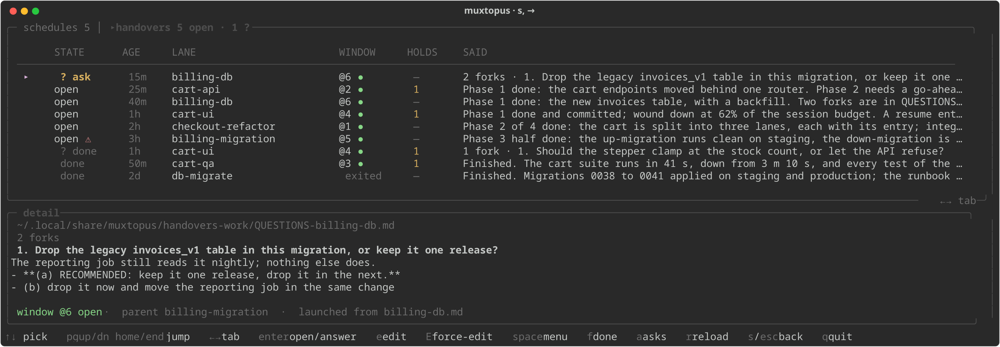


# Handovers and questions

When a window is asked to wrap up, it writes a handoff so the *next* window can start from three paragraphs instead of carrying a quarter-million tokens of context forward. A lane that has questions nobody is there to answer writes them to a file beside it, and the file is where the answer goes back.

```bash
handover.sh path <slug>       # print where to write it (makes the folder)
handover.sh write <slug>      # write it from stdin
handover.sh list              # what is open, what is asked, how much is done
handover.sh show <name>
handover.sh done <name>       # finished: moves it to done/
handover.sh reopen <name>
handover.sh answered <name>   # that lane's QUESTIONS file is settled
handover.sh unanswer <name>   # ...it is not, after all
handover.sh --profile work list
```

## Where they live

A handover is `STATUS-<slug>.md` in the account's `handovers/` folder, and a finished one is moved into `handovers/done/`. Three decisions worth stating, because all three were bugs first:

- **They do not live in the working tree.** A `STATUS-<window>.md` in the repo is scratch state under version control — and once a second account works the same repo, two windows of the same name overwrite each other's handoff without a word.
- **`done` moves, it does not delete.** A finished handoff is the record of what a lane actually did and costs nothing to keep. Moving it is also what makes `list` mean something: what is left in the folder is what is still owed. A repeated window name gets a timestamped second copy rather than erasing the first.
- **There is one definition of "open" and "done", and it is the executor's.** `after: <slug>` is satisfied by `done/STATUS-<slug>.md`, tested *before* the open file — so a lane that ran, was marked done and ran again is finished as far as every held entry is concerned, whatever its open handover says. The watchdog, the dashboard's WHY line and the handovers tab all call the same function (`muxhandovers.lane_state`), and a test greps that order out of `claude-watchdog.sh` so the shell side cannot drift away from it. The tab draws that lane `open ⚠` and says which file is doing the releasing, because it is a real trap and hiding it was how it stayed one.

The file is named by the **slug**, never the tmux display name. A lane's window is called `<slug>`, but a window opened by an older release still carries `➥` markers, and building a path from the display name would ask for `STATUS-➥lane.md` while the same window's own footer told the worker `STATUS-lane.md`. The resolved slug and the full handover path are pasted into every scheduled window's prompt above everything else, and `{{HANDOVER}}` in a body resolves to the same path — see [placeholders](schedules.md#placeholders-in-the-body).

## The questions contract

A lane's **questions** live beside its handover, as `QUESTIONS-<slug>.md` in the same folder — the path the `{{QUESTIONS}}` placeholder resolves to when the window is launched, so the lane is told where to write them and the dashboard knows where to look. A file is **answered** when some line of it matches `ANSWERED`, which is what was already being typed by hand before anything read it.

The shape the readers understand — the dashboard's answer screen and the Telegram bot both parse it — is a numbered fork with lettered options and the recommended one marked:

```
# QUESTIONS — checkout-refactor

1. **Which way round should the strip read?** The tab that is open is the one
   in bold, and the other carries its count.
   - **(a) RECOMMENDED: schedules first, handovers second.**
   - (b) whichever was open last, first.

2. **What a done row costs.** Thirteen of them today, one per lane, forever.
   - (a) hide them behind a filter
   - (b) show everything
```

An answer is one line at the end of its own fork, written atomically onto the file that was parsed:

```
**Answer (user, 2026-09-18):** (a) — because it reads left to right
```

No parser will understand every lane's prose, so the file is always the escape hatch: the editor is one key away on every screen that reads it, and a fork the parser cannot make sense of is shown as text with the editor offered.

The file does **not** move when it is marked: `{{QUESTIONS}}` told that lane that exact path and the lane reads its answers there. It travels with its handover instead — `done` carries an answered one into `done/` and **leaves an unanswered one**, because a finished lane's unanswered forks are still owed a look. Adding a fork to a file that is already marked means deleting the marker line; a new question under an old marker is one nobody will be shown.

A lane launched with the `questions` option ticked in [the options table](schedules.md#the-options-table) is told all of this in its brief: do not ask, write the fork with a recommendation to `QUESTIONS-{{SLUG}}.md`, and proceed with the recommendation.

## The handovers tab (`s`, then `→`)



The `s` screen has two tabs and the arrows move between them. The strip names both and carries their counts, so from the schedules you can still see how many handovers are open and how many question files are waiting on you.

```
╭ schedules 6 │ ▸handovers 4 open · 3 ? ─────────────────── ←→ tab ╮
   STATE      AGE   LANE                    WINDOW   HOLDS  SAID
 ▸ ? ask      2h    handover-visibility     @31 ●    —      3 forks · 1. Filter persistence
   open       12m   dash-menus-settings     @24 ●    1      Phase 2 done; 36 captures green
   open ⚠     3d    27-hardening            —        —      Handoff — roadmaps 25-27 hardening
   done       1d    sched-options-core      exited   —      Finished. All six phases done
```

The rows are every `STATUS-*.md` and `QUESTIONS-*.md` of this account, from both folders, in the order of **what is owed**: unanswered questions first, then open handovers, then everything finished. The cursor starts at the top, which is the actionable end.

| column | |
|---|---|
| `STATE` | `? ask` a question file with no ANSWERED marker · `? done` one that has · `open` a handover its lane has not marked done · `done` one it has |
| `open ⚠` | **red**: the watchdog calls that window `stranded`. **yellow**: a `done/` twin of this file from an earlier run already satisfies every `after: <slug>` — the lane ran, was marked done, and is running again. The detail panel says which file, in words |
| `AGE` | how old the file is |
| `WINDOW` | the window the lane was launched in, `●` while it is still open, `exited` when it is gone |
| `HOLDS` | how many PENDING entries are waiting on this lane. The entry always knew; the lane never did |
| `SAID` | the handover's first useful line, or `N forks · <the first one>` |

| key | |
|---|---|
| `enter` | on a question file: **the answer screen**. On a handover: read-only, in the pager — a live lane rewrites its handover whenever it likes, and an editor saving over that is how one is lost |
| `e` | edit a question file |
| `E` | edit a handover *anyway* — behind a warning when its lane's window is still open and whichever of you saves last would win |
| `space` | the row's menu: view, edit anyway, open its window, mark done, mark answered, tell that window its answers are in, show its handover |
| `f` / `a` | show or hide everything finished / the question rows. Both are remembered — `R` re-execs the dashboard and would otherwise reset them every time. What a filter hides is always counted on the panel border |
| `r` | re-read the folder |
| `←` `→` | back to the schedules |
| `s` / `esc` | back to the main view |

**Marking a handover done from here launches things.** Every entry held `after:` that lane fires within 30 seconds, so the confirm names them: `Mark dash-split done?  releases: handover-vis-impl, notify-dash`. Every state change shells out to `handover.sh`, so never-clobber and the ANSWERED marker have one implementation and not two.

### Answering a fork without leaving the dashboard

`enter` on a question file opens its forks one at a time — the lettered options as rows with the recommended one already picked, the fork's full text above them, and the editor one key away on every screen, because no parser will understand every lane's prose and the file is always the escape hatch. A chosen option may take a note; enter with nothing typed means no note. Each answer is written the moment you give it, as one line at the end of its own fork, atomically, and onto the file that was parsed: if the lane rewrote it meanwhile the answer is re-applied to the same fork and the screen says so. `esc` leaves at any point and what was answered stays answered. When the last fork is answered it offers to mark the file ANSWERED and, if that lane's pane is live, to tell it so.

The same forks can be [answered from the phone](notifications.md#the-phone-can-answer), by the same function, into the same line.

**On the main view**, a session whose lane has an unanswered question file carries a yellow `?` beside its name and the key line says how many are waiting in all. That reads the same two folders, at most once every five seconds, so the main frame pays a glob and no fork.

## What a lane is told

A scheduled window's prompt starts with `[muxtopus]` identity lines the executor builds from the resolved values: which window it is, its slug, and its handover file, stated as winning over anything the brief names. A `work` entry's footer tells it to keep the handover current and to run `handover.sh done <slug>` when the whole item is finished — which is the signal every `after:` entry and the handovers tab wait for. A window that ends its turn without marking done, and then sits idle with nothing pending naming it, is what the watchdog calls [`stranded`](watchdog.md#stranded).

