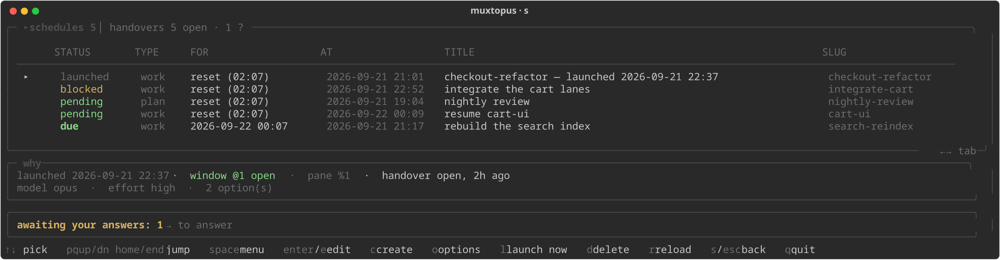


# Scheduled windows

One hand-editable `.md` per window to open later, in the account's `schedules/` folder ([one folder per account](accounts.md#one-folder-per-account)). The watchdog daemon launches due items and the dashboard's `s` view lists them; the same view is where `c` on the main view writes one from a picker. A file the view cannot parse is shown as corrupted with the reason and never launches — a schedule that quietly does nothing is the worst failure a scheduler can have.

```
type: work
at: reset
title: resume the checkout refactor
slug: checkout-refactor       # optional: pins the lane name
window: api-cleanup           # optional: insert the new window after this one
after: api-cleanup, db-migrate # optional: hold until ALL of those have finished
parent: api-cleanup           # optional: draw this window under that one
cwd: /home/you/src/checkout
model: opus                   # optional: claude --model
effort: high                  # optional: claude --effort
permission-mode: bypassPermissions   # optional: claude --permission-mode
watchdog: off                 # optional: never restart this session after a limit
monitor: off                  # optional: never wind this session down
rc: on                        # optional: send /rc once it is ready (default: Settings)
options: questions, phases, lanes=3, model=opus[1m]   # written by the options table
status: pending
created: 2026-09-06 09:55
launched:
---
the prompt body that gets pasted into the new window
```

The new window opens right after its `window:` target, named with a leading `➥`, and the prompt lands as **one bracketed paste** — never `send-keys`, which submits at every newline.

## The header, field by field

| field | required | values | |
|---|---|---|---|
| `type` | yes | `plan` · `work` | a `work` entry pastes its body as the prompt and must have one; a `plan` entry may have an empty body — the session then receives its identity line and nothing invented — and may name a `template:` |
| `at` | yes | `reset` · `YYYY-MM-DD HH:MM` | when it is due. `reset` is [two gates](#at-reset-is-two-gates); an absolute time (anything `date -d` accepts, but the dashboard's linter wants `YYYY-MM-DD HH:MM[:SS]`) fires when it passes |
| `title` | yes | free text | what the row says; the slug is derived from it unless `slug:` is set |
| `slug` | no | `[A-Za-z0-9._-]`, ≤ 22 | pins [the lane's name](#the-slug-is-the-lanes-name-in-four-places) and wins over the title |
| `window` | no | a tmux window name | insert the new window after this one. When it names a live window it also becomes the parent |
| `after` | no | slugs, comma or space separated | hold until [every named lane is done](#after-slug-slug) |
| `parent` | no | a slug | [draw this window under that one](#parent-slug--draw-this-window-under-that-one); usually derived from `window:` |
| `cwd` | yes | an existing directory | where the session starts |
| `template` | no | a file in `templates/`, without `.md` | `plan` only: the body is built from it |
| `model` | no | `fable` · `opus` · `sonnet` · a full model id | [`claude --model`](#model-and-effort); absent is the account default |
| `effort` | no | `low` · `medium` · `high` · `xhigh` · `max` | `claude --effort` |
| `permission-mode` | no | `acceptEdits` · `auto` · `bypassPermissions` · `manual` · `dontAsk` · `plan` | [`claude --permission-mode`](#permission-mode-the-one-setting-that-cannot-be-fixed-after-launch); absent means absent |
| `watchdog` | no | `off` | [never restart this session after a limit](#watchdog-off-and-monitor-off) |
| `monitor` | no | `off` | never wind this session down |
| `rc` | no | `on` · `off` | [send `/rc` once the window is ready](#rc-on-and-rc-off); absent is the Settings default, `DASHBOARD_NEW_RC` |
| `options` | no | `key, key=value, …` | [what the options table ticked](#the-options-table); the executor parses nothing from it |
| `status` | written by the executor | `pending` · `launched` · `error` · empty | empty counts as pending. `error` is a launch that failed, with the reason in the log and on the phone |
| `created` | informational | a timestamp | |
| `launched` | written by the executor | a timestamp, or empty | |

Everything after the `---` line is the body. A `## Options` heading at its end is regenerated by the options table; everything above that heading is yours byte for byte.

## `permission-mode:`, the one setting that cannot be fixed after launch

A scheduled window is unattended by definition. Without this field the launcher passes no mode, so the window inherits `defaultMode` from settings.json — and a window in `auto` that reaches a decision it will not take on its own simply **stops**, silently, with no prompt anyone is there to answer. Measured 2026-09-16: that is how four lanes sat idle for three days.

Nor can it be corrected once the window is open: shift+tab cycles auto → manual → accept edits → plan → auto, and `bypassPermissions` is **not** in that cycle. The launch command is the only way in.

Accepted values are whatever `claude --permission-mode` takes at the installed version — today `acceptEdits`, `auto`, `bypassPermissions`, `manual`, `dontAsk`, `plan`. Case is folded to the CLI's spelling and the fold is logged; anything else is dropped with a log line and no flag, because `claude` exits 1 on an invalid mode and the window would then never reach a prompt. **Absent means absent** — no flag, the account's own setting — and that stays the default, because an unattended window that skips every permission check is a choice the entry should have to make out loud.

`claude-watchdog.sh --check <entry>` reports the resolved mode beside `model` and `effort`, and the launch line in the log records it as `perm=<mode>`.

## `watchdog: off` and `monitor: off`

The dashboard's per-session opt-outs, for a window that should start out exempt. Only `off` (any case) opts out; anything else, or no line, is the default: covered. They are header fields the **launcher** applies, not something the dashboard writes at create time, because the opt-out files are keyed by session id and a session id does not exist before launch. Once the prompt is up the launcher finds the `sessions/*.json` whose `.tmux` names its pane, appends that id exactly as `--optout` / `--monitor-optout` do, and logs it; if none turns up within ~5s the window is left watched and the log says so. `--check` prints both.

## `rc: on` and `rc: off`

`rc: on` sends `/rc` — remote control — to the new window once it is ready, so the session can be reached from claude.ai or a phone without anyone typing it. The same shape as the two opt-outs above, and applied by the launcher for the same reason: there is nothing to send it to before launch. It goes after the trust dialog and the readiness wait, and **before** the paste — once the body is in, the window is working, and a `/rc` typed then would be queued as a message to the model. Anything `/rc` leaves holding the keyboard is closed with Escape, and the log says so.

Unlike the opt-outs, both values mean something, because there is a default: **`DASHBOARD_NEW_RC`** (`esc ▸ Settings ▸ Send /rc to a new window`, off). Switched on, *every* new scheduled window gets `/rc` — hand-written entries and `c` alike — unless its entry says `rc: off`. Any other value is ignored and the default applies. `claude-watchdog.sh --check <entry>` prints the resolved value and where it came from, and the launch line in the log ends in `rc=on`.

## `model:` and `effort:`

`model: opus` becomes `claude --model opus`, `effort: high` becomes `claude --effort high` (`low` · `medium` · `high` · `xhigh` · `max`). Absent means the account default from `settings.json`; a value the CLI would reject is logged and dropped rather than passed through, because `claude` exits on a bad flag and the window would never reach a prompt.

## The slug is the lane's name in four places

It names the window, the handover file, the `handover.sh done <slug>` the worker is told to run, and the entry in the window tree. It is derived from the title by replacing everything outside `A-Za-z0-9._-` with `-` and cutting to 22 characters, which is how `title: 27-storage wave 2` once became the slug `27-storage-wave-2` while the lane's own brief said `27-storage` — two handover files for one lane, nothing watching the one that was written, and no warning anywhere.

So `slug:` pins it and wins over the title; a title that does not survive the derivation unchanged is **warned about** in the log, in `--check` and on the dashboard row (the SLUG column shows the resolved answer); and the resolved slug and full handover path are rendered **into the pasted body**, above everything else, saying they win over anything the brief names. A brief and the tooling can no longer disagree.

## `at: reset` is two gates

An entry fires on whichever comes first:

1. **the budget reads fresh** — `session_pct <= 10`. A rolling five-hour window that has just rolled has no reset time at all, so a barely-touched budget is due on its own. This gate fires on a quiet account whether or not anything ever hit a limit.
2. **the window rolled over** — `now >= session_reset_at + 20s`, whatever the budget then reads.

The launch line names which one fired, so a launch can be explained after the fact:

```
schedule lane-27-storage.md: launched ➥27-storage (pane %401) type=work
  slug=27-storage -- due: the session window rolled over at 10:10
```

An absolute time (`2026-09-06 14:30`, or anything `date -d` accepts) fires when it passes.

A budget *reading* older than `WATCHDOG_USAGE_STALE` (default 180 min) cannot fire gate 1 — the bucket refills over five hours, so a three-hour-old percentage says nothing about now. The reset *epoch* is exempt: it is an absolute moment and stays true however old the row carrying it is.

## Every pending entry says why it has not fired

The watchdog writes a verdict per pending entry every pass, to `sched-why.tsv` in its state directory:

`due` · `waiting` · `blocked` · `stalled`, each with the sentence that explains it, republished every pass and rendered under the table in the `s` view for the row under the cursor.

`stalled` means it cannot be judged at all and will not resolve on its own. That case used to be **silent and permanent**: an empty `session_pct` was coerced to 100 (failing gate 1) and an empty `session_reset_at` failed gate 2, so an unreadable usage cache made every `at: reset` entry undue *forever*, with no log line and no error. Now it is named, it turns the row red, the reason is printed under the table, and the watchdog asks for a fresh `/usage` probe (at most one per quarter hour) to clear it.

```bash
claude-watchdog.sh --check                    # every entry
claude-watchdog.sh --check 27-storage         # one, by file, basename or slug
claude-watchdog.sh --check 27-storage --body  # ...and the exact paste
```

`--check` resolves an entry without launching anything: the parsed fields, the slug and where it came from, the window name, the handover path, the insert target resolved against the live session, the size of the paste, and the due verdict with its reason.

## `after: <slug>[, <slug>…]`

```
after: 27-storage
after: 24-c1-schema, 24-c2-rows, 24-c3-ui     (comma or space separated)
```

Holds an entry until *every* named lane is done. "Done" means, in order:

- its handover has been marked done — moved into `handovers/done/` by `handover.sh done <slug>`, which is the lane saying so itself; or
- a window the tree knows about has **exited** without leaving an open handover: the work is over whether or not it went well.

An *open* handover means the lane is still running — that file is written early and lives until it is marked done. A dependency nothing has ever launched holds the entry too, and says so.

The list is what an orchestrator needs: "integrate the four lanes" is one entry waiting on four, not four entries in a chain — and a chain would also serialise work that ran in parallel. The verdict names the first lane still holding and how many are left, because that is the one to act on:

```
blocked: waiting for 2 of 3 -- next: 24-stars, handover open 31m ago,
not marked done (handover.sh done 24-stars)
```

`--check` prints the per-lane breakdown underneath when there is more than one. A slug naming the entry's own lane is refused from any position: it can never finish first.

There is deliberately **no timeout**. A dependency that gives up and runs anyway is worse than one that waits, and a wait is visible in three places: `--check`, the WHY line under the dashboard table, and one log line when the verdict changes. Editing or deleting the entry is the escape hatch.

**There is one definition of "open" and "done", and it is the executor's.** `after: <slug>` is satisfied by `done/STATUS-<slug>.md`, tested *before* the open file — so a lane that ran, was marked done and ran again is finished as far as every held entry is concerned, whatever its open handover says. The watchdog, the dashboard's WHY line and the handovers tab all call the same function (`muxhandovers.lane_state`), and a test greps that order out of `claude-watchdog.sh` so the shell side cannot drift away from it. The handovers tab draws that lane `open ⚠` and says which file is doing the releasing.

## `parent: <slug>` — draw this window under that one

tmux has no window hierarchy: windows are a flat indexed list, with no parent to set and nothing to collapse. So the tree is *data* the scheduler keeps (`tree.tsv`: slug, parent, window id, pane id, launched-at) plus a *view* — [the dashboard renders it](dashboard.md#the-window-tree), and `←` there folds a subtree.

`parent:` is usually unnecessary. It is **derived** from `window:` whenever that names a live window — hand-made orchestrators included, which is how most lanes are actually launched. The named window is adopted as a root so the child has something to hang from, and a lane already recorded as a root is re-parented from its entry on the next pass, so an existing tree fills in without being rewritten. `parent:` set explicitly wins.

What the flat list *can* honour, it does: the depth is carried by the name (`➥lane`, `➥➥child`, `➥➥➥` below that), and a child is inserted after the **last** window of its parent's subtree, so a family stays contiguous as siblings arrive.

```
claude-watchdog.sh --tree     what the tree currently holds
```

## Placeholders in the body

The body is not a literal string. Seven names are resolved when the body is *pasted*, over the template, the body and the work footer — never over the `[muxtopus]` identity lines at the top, which are built from the resolved values already:

```
{{SLUG}}       27-storage
{{WINDOW}}     the tmux window name, arrows included: ➥27-storage
{{HANDOVER}}   <handovers>/STATUS-27-storage.md
{{QUESTIONS}}  <handovers>/QUESTIONS-27-storage.md
{{SCHEDULES}}  the schedules folder
{{CWD}}        the entry's cwd: field
{{PARENT}}     the entry's parent slug, or empty for a root window
```

They exist because the slug is not knowable when a body is *written* — least of all in a template shared by twenty entries — so a sentence that needs it carries a placeholder and the executor resolves it as the window opens. One function does the substitution, shared by the launcher and by `--check --body`, so the report and the paste cannot drift apart.

A `{{NAME}}` outside that table is left in the paste as **literal text** and warned about — in `--check`, in the log at launch, and as a yellow note on the dashboard row, the same way a derived slug is. It is never blanked: a body that meant to say `{{PORT}}` still says it. `--check <entry> --body` shows the substituted paste, so a wrong placeholder is visible before anything launches.

## The `s` view



| key | |
|---|---|
| `↑` `↓` | pick an entry; the WHY panel under the table explains the one under the cursor |
| `enter` / `e` | edit it |
| `c` | create: type, template, the options table, then the editor to paste the prompt |
| `o` | reopen the options table on a pending entry |
| `l` | launch now |
| `d` | delete |
| `r` | reload |
| `space` | the entry's menu |
| `←` `→` | the handovers tab |
| `s` / `esc` | back |

The row carries a yellow `⚠` note when the title is not a slug or the body names a placeholder the table does not know; the SLUG column shows the resolved answer. A red `stalled` row cannot be judged at all.

### The schedule view's menu

`space` on an entry opens **that entry's** menu, drawn by the same never-clipped engine: the executor's *why* sentence first when the entry is blocked, waiting or stalled; edit; options (the table, pre-ticked from the header); launch now; duplicate as a new pending entry (a `-copy` title, a pinned `slug:` dropped so two entries never share a window name and a handover, then the editor); check (the `--check --body` report, full screen); open its window when it has one; delete. A corrupted entry gets its reason and only delete. Nothing in it acts on a claude session.

### The options table

Five sentences go into nearly every brief anyone writes — *don't ask questions, nobody is watching*; *one commit per phase*; *don't push*; *`/low-priority` on a limit*; *a change you never ran is not verified*. `c` offers them as checkboxes between the template and the editor, and `o` reopens the table on a pending entry.

They come from `~/.config/muxtopus/options.md`, which is **yours**: one block per option, blank-line separated, the same `key: value` syntax as a schedule header, `#` comments anywhere. The comment block at the top of the file is the format spec. `install.sh` copies it from `seeds/options.md` in the checkout if it is missing, and never rewrites it after that; `profiles/<name>.options.md` overrides or adds to it **field by field** for one account.

```
key: questions            # the id in `options:`, [a-z0-9-]+, unique
group: contract           # the table's section heading
label: questions go to a file
hint: nobody is watching: QUESTIONS-{{SLUG}}.md, recommended answer
default: on               # ticked when the table opens
types: work               # optional: only offered for this type
line: Nobody is watching this window: do not ask questions. …
```

A tick writes one of two things: a **sentence**, appended to the body under a `## Options` heading at the end of it, or a **header field** — `set: model` with `choices:` opens the picker and writes `model:`, which the launcher passes as `claude --model`. `ask: number` (or `text`) collects a value on toggle and substitutes it into `{{VALUE}}`.

The actions are **rows** at the bottom of the table: *check all*, *uncheck all*, *continue* (save what is ticked, then the editor; *save* on a reopen) and, on create only, *skip* (continue with nothing ticked). `space` or `enter` ticks an option row; `enter` on an action row does that thing. **`esc` cancels** on create and on reopen alike: on create no entry file is written at all, on reopen the file is untouched.

The header also records `options: questions, phases, lanes=3`, and **that is the source of truth**. `o` reopens the table from it and regenerates the section, so a sentence edited by hand in that section is overwritten on the next save — move it above the heading (everything above is preserved byte for byte) or edit it in `options.md` where it came from. **The executor parses nothing from that line**: the sentences those options produce are ordinary body text by the time the folder is read, and the header fields they set are ordinary header fields. Deleting the line changes nothing about how the entry runs — only what the table shows when reopened.

Every other placeholder — `{{SLUG}}`, `{{WINDOW}}`, `{{HANDOVER}}`, `{{QUESTIONS}}`, `{{SCHEDULES}}`, `{{CWD}}`, `{{PARENT}}` — is written out **literally** and resolved when the prompt is pasted, because the slug does not exist while the table is open. `{{VALUE}}` is the exception: it is what the prompt collected, and it is resolved in the table.

A block the reader cannot make sense of is shown greyed with its reason and cannot be ticked, exactly as a corrupted schedule entry is — it is never silently dropped. `python3 muxconfig.py --options` prints the same verdicts without a dashboard.

## `stranded`, and why the orchestrator is a pattern rather than a process

An orchestrator doing two jobs at once — splitting a plan into lanes and writing their briefs, which needs a model, and noticing when a lane stops, which needs a clock — spends tokens on the second. Measured: four lanes settled into one state and stayed there for 3½ days, and the first change the watching loop saw woke the orchestrator to broadcast a pause to four windows, four turns for a message that said "do nothing". **So the liveness half belongs in the watchdog, a deterministic loop that costs nothing, and the judgment half belongs in a Claude window that stops between the two** — the window writes one entry per lane and one more with `after:` naming all of them, then ends its turn.

That needs the scheduler to say when a lane has gone quiet for good, which is what [`stranded`](watchdog.md#stranded) is: a `➥` window, idle past `WATCHDOG_STRANDED` minutes, with an **open** handover, and no pending entry naming it — not its slug, not its `resume-` entry, not an `after:` waiting on it. `idle` is a fact about the last turn; `stranded` is a fact about the future, and it is shown to a human rather than acted on. Nothing automatically resumes a stranded lane: an unrequested turn is still a turn. (A window the daemon itself wound down hard *is* resumed once its budget comes back — see [resuming a wind-down](watchdog.md#resuming-a-wind-down). That is a different case: there the turn was requested, by the directive that told the window to stop.)

